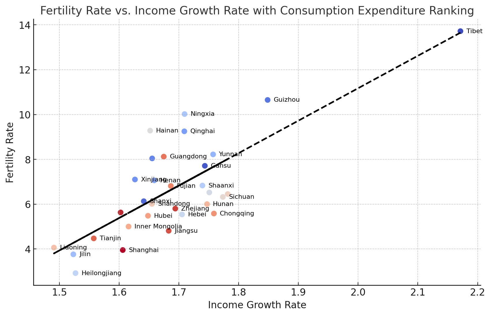

**世界杯赔率的计算方法：**

在前不久的卡塔尔世界杯中，身边有很多人赌球，我就很好奇赌场不同玩法的赔率是怎么形成的。

查阅了一些资料了解到进球数服从泊松分布，所以这里做了一个验证，验证了 胜负平 让球 比分 总进球 半全场 这些不同的玩法，
只要通过双方球队平均进球数两个数字就可以决定剩下所有的赔率。

先通过比分赔率反向计算赌场假定的球队平均进球数，然后用这两个数推算其他的赔率，和赌场赔率十分吻合，所以可以证明赌场确实是用泊松分布假设的。

在这个过程中，还可以确定赌场的抽水具体是怎么抽的。

数据来源：
https://www.sporttery.cn/jc/jsq/zqbf/

**出生率为什么低**

通过省市之间比较的横截面分析，可以控制变量的理解出生率的影响因素

横轴是 2016-2023年 人均可支配收入增长率，纵轴 是 2023 年 的生育率

红色染色是人均消费支出高的消费省市，蓝色是低消费省市

可以看出 可支配收入的增长率 可能是真正影响 生育率的指标

人均消费 可以部分的解释 残差部分：高消费城市比预测值偏低，低消费比预测值稍高

一个可能的解释：生育是一个 投资行为：

1. 未来人力价值越高，代表未来收益越高，生育越有价值
2. 人均消费越低，生育越划算
